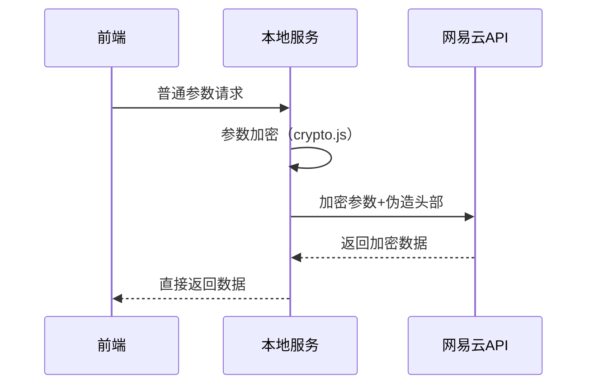

# netmusic-node

## 项目简介

本项目是一个**网易云音乐API本地中转代理服务**，用于安全、便捷地在本地或内网环境下调用网易云音乐的各类接口。它通过模拟网易云官方客户端的加密与请求流程，将前端请求参数自动加密、适配并转发到网易云官方服务器，返回原始数据给前端。适用于小程序、Web、移动端等多种场景，前端无需关心加密细节。

---

## 主要特性
- **中转代理**：所有请求均由本地服务转发，隐藏真实API细节，保护前端安全。
- **加密适配**：内置网易云官方加密算法（双层AES+RSA），自动处理所有参数加密。
- **接口兼容**：路由与网易云官方API高度一致，支持绝大多数常用功能（登录、推荐、歌单、搜索、播放、评论等）。
- **前端无感**：前端只需请求本地接口，无需实现任何加密逻辑。
- **多端支持**：适配微信小程序、Web SPA、移动端等多种客户端。

---

## 安装与依赖

### 1. 克隆项目
```bash
git clone git@github.com:ZeroTB01/-.git
cd netmusic-node-master
```

### 2. 安装依赖
```bash
npm install
```

#### 主要依赖
- express：Web服务框架
- request：后端HTTP请求库
- big-integer：大整数运算（RSA加密）
- tough-cookie：Cookie处理

---

## 启动方式

### 1. 直接启动
```bash
node app.js
```

### 2. 使用pm2/forever等守护进程
```bash
pm2 start app.js
# 或
yarn global add forever
forever start app.js
```

服务默认监听3000端口（如需更改请在app.js中自行修改）。

---

## 典型用法

### 1. 访问接口示例

- 获取FM电台：
  - `GET http://localhost:3000/v1/fm`
- 推荐歌单：
  - `GET http://localhost:3000/v1/personalized`
- 搜索：
  - `GET http://localhost:3000/v1/search?keywords=周杰伦`
- 手机号登录：
  - `GET http://localhost:3000/v1/login/cellphone?phone=手机号&password=明文密码`

### 2. 返回示例
返回内容与网易云官方API一致，通常为JSON对象。

---

## 技术原理

### 1. 加密适配层
- 参数加密采用“双层AES+RSA”方案，兼容网易云官方接口校验。
- 相关实现详见`crypto.js`，核心流程：
  1. 参数转JSON字符串
  2. 先用固定密钥nonce做AES加密，再用随机密钥secKey做AES加密
  3. secKey用官方公钥做RSA加密
  4. 组装为`params`和`encSecKey`发送

### 2. 代理转发
- 所有API请求由本地服务统一转发到`music.163.com`，并伪造Referer、User-Agent等头部。
- 支持自动重试、cookie模拟、登录态缓存等。

### 3. 主要流程图


---

## 相关项目推荐
- [音乐微信小程序](https://github.com/ZeroTB01/-/tree/main/NeteaseMusicWxMiniApp-master)

